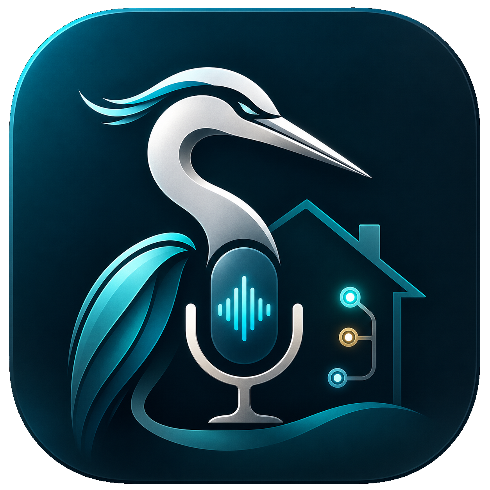

# Heron



Heron is an AI layer on top of your existing [Loxone](https://www.loxone.com/) home automation system. It does **not** replace Loxone's own automation logic (Config/rules running on your Miniserver) — it adds a natural-language, voice-first interface on top of it: talk to your house from an Android app, ask what state things are in, and ask it to change things, with broader context (weather, calendar, etc.) to help you get more out of the automation you already have.

You talk to it, it talks back — no typing required once it's set up.

## Prerequisites

- An [Anthropic API key](https://console.anthropic.com/) (Heron is powered by Claude).
- A Loxone Miniserver on your home network, with a username/password you can log in with.
- A computer on the same network to run Heron on (Windows or Linux). It needs Docker — **you don't need to install Docker yourself**, the install script below checks for it and installs/starts it for you. (On Windows, if Docker Desktop itself has never been installed before, it will need one manual first-run step — the script tells you exactly what to do.)
- An Android phone.

## Quickstart

1. Clone this repository:
   ```
   git clone https://github.com/DavorBaljak/Heron.git
   cd Heron
   ```

2. Run the installer:
   - **Linux / macOS:** `./scripts/install.sh`
   - **Windows (PowerShell):** `.\scripts\install.ps1`

   It will ask you for:
   - Your Anthropic API key
   - Your Loxone Miniserver's address, username, and password

   Everything else — building the images, starting the services — happens automatically.

3. When it finishes, the script prints what you'll need:
   - A **gateway address** (`your-computer's-LAN-IP:8190`) and **pairing token**, for the Android app.
   - A **dashboard URL** (`http://your-computer's-LAN-IP:8191`) — open it in any browser on your home network to see a live, auto-generated schematic of your house: every room, every control, updating in real time as things change. Read-only — it shows state, it doesn't control anything.

4. Download the Android app APK from this repository's [Releases page](../../releases).

5. Heron isn't on the Google Play Store yet, so you'll need to sideload it: open the downloaded APK on your phone and allow "Install unknown apps" when prompted for whichever app you used to open it (Files, Chrome, etc.).

6. Open the app, tap **Settings**, and enter the gateway address and pairing token from step 3. You're connected.

7. Talk to it — tap the mic button, or turn on "Always listening" and just say "Heron" followed by what you want.

## Troubleshooting

- **Can't connect from the phone or browser:** make sure the device is on the same Wi-Fi network as the computer running Heron, and that nothing (a firewall) is blocking ports `8190`/`8191` on your LAN.
- **Wrong Loxone credentials, or you changed your Miniserver password:** delete `data/agent/loxone-config.json`, `data/gateway/loxone-config.json`, and `data/dashboard/loxone-config.json`, then re-run the install script — it will ask you for the connection details again.
- **Want to change the Anthropic API key:** edit `.env` directly, then restart: `docker compose up -d --force-recreate heron-agent gateway`.
- **Checking it's actually running:** `docker compose ps` should show `heron-agent`, `gateway`, and `dashboard` as `Up`. `docker compose logs gateway` shows the pairing token again if you need it.

## For developers

This README is for people running Heron day-to-day. If you want to understand how it's built, extend it, or run it against the built-in Loxone simulator instead of a real Miniserver, see [`ARCHITECTURE.md`](./ARCHITECTURE.md) (the required design) and [`CLAUDE.md`](./CLAUDE.md) (current implementation state, commands, and package layout).
